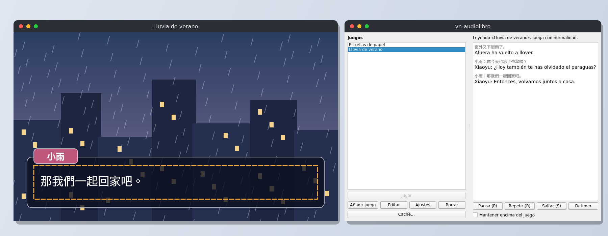

<p align="center">
  
</p>

<p align="center">
  <a href="https://github.com/v1kz25/visualnovel-traductor/actions/workflows/ci.yml"></a>
  <a href="https://github.com/v1kz25/visualnovel-traductor/releases/latest"></a>
  <a href="LICENSE"></a>
  
</p>

# vn-audiolibro

Audiolibro en español, en tiempo real, para novelas visuales en chino y japonés.



<sub>Escena de ejemplo dibujada para esta imagen; no pertenece a ningún juego.</sub>

Mientras juegas, la app lee el texto de la ventana del juego, lo traduce al español (o al inglés, si lo eliges para ese juego) y lo reproduce con voz. Todo funciona en tu equipo: sin cuentas, sin coste y sin conexión (salvo para descargar los modelos la primera vez).

> Última versión: **v0.2.0**, para Linux y Windows.

## Cómo funciona

1. Eliges la ventana del juego y dibujas un recuadro sobre la zona del texto (una vez por juego).
2. La app detecta cuándo aparece texto nuevo, lo reconoce con OCR y lo traduce con un modelo local.
3. Oyes la traducción con voz sintética y la ves en la ventana de la app. Lo ya traducido queda en caché.

## Requisitos

- **Linux** x86_64 con una sesión **X11** (no Wayland) y PulseAudio o PipeWire, con `paplay`
  (paquete `pulseaudio-utils`).
- **Windows** 10 u 11 de 64 bits.
- Unos 2 GB libres en disco para los componentes que se descargan la primera vez.
- 8 GB de RAM recomendados.

## Instalación

### Linux

Descarga el AppImage de la última versión en [Releases](../../releases) y:

```bash
chmod +x vn-audiolibro-*.AppImage
./vn-audiolibro-*.AppImage
```

La primera vez descarga los componentes que necesita (unos 1,2 GB) mostrando su licencia y el
progreso. Después funciona sin conexión. Desde la terminal: `./vn-audiolibro-*.AppImage --help`.

### Windows

1. Descarga `vn-audiolibro-X.Y.Z-windows-x64.zip` de la última versión en [Releases](../../releases).
2. Descomprímelo donde quieras (por ejemplo, en `Documentos`). No necesita instalación.
3. Abre `vn-audiolibro.exe`. La primera vez te ofrece añadirlo al menú Inicio (también con
   `vn-audiolibro-consola.exe instalar-acceso`).

El ejecutable no está firmado, así que la primera vez Windows SmartScreen puede avisar de que
«Windows protegió su PC». Pulsa **Más información** y después **Ejecutar de todas formas**.

Para usar la app desde la terminal está `vn-audiolibro-consola.exe` (por ejemplo,
`vn-audiolibro-consola.exe --help`). Los componentes descargados, los juegos y la caché se guardan
en `%LOCALAPPDATA%\vn-audiolibro` y los ajustes en `%APPDATA%\vn-audiolibro`.

## Uso

1. **Añadir juego**: elige la ventana del juego, captúrala y dibuja un recuadro sobre la caja de texto.
   Ahí se elige también el idioma de la traducción y de la voz: español (por defecto) o inglés.
   La voz inglesa (unos 64 MB, de dominio público) se descarga la primera vez que se usa.
2. **Jugar**: la app lee cada línea nueva, la traduce y la dice en voz alta mientras juegas.
3. **Ajustes**: voz (mujer u hombre) y velocidad, cómo leer cuando avanzas deprisa, volumen del juego
   y de otras aplicaciones, y glosario de nombres propios.

## Desarrollo

```bash
uv sync
uv run vn-audiolibro
uv run pytest
uv run ruff check
empaquetado/construir_appimage.sh   # AppImage en build/appimage (necesita libxcb-cursor0)
empaquetado/construir_windows.sh    # zip portable en build/windows (en Windows, con Git Bash)
uv run python herramientas/imagenes_readme.py   # regenera el banner y las capturas de .github/assets
```

## Contribuir

Los errores y las propuestas se abren como [issues](../../issues/new/choose). Si quieres enviar un
cambio, lee antes [`CONTRIBUTING.md`](CONTRIBUTING.md).

## Licencia

GPL-3.0-or-later. Ver [`LICENSE`](LICENSE).
